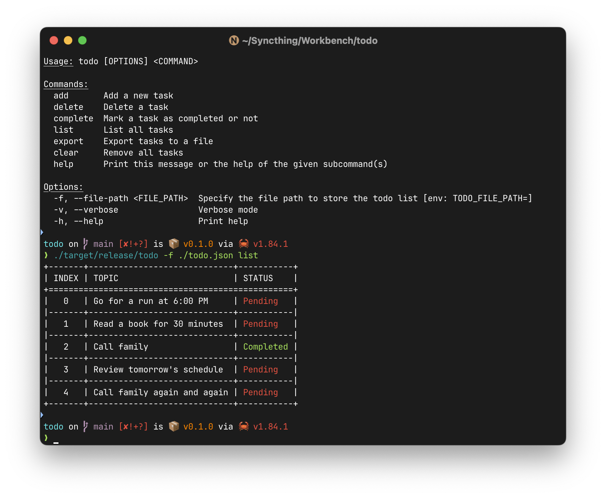

# Todo CLI Application



A simple command-line todo list manager written in Rust. This is my first project in Rust, so it may not be idiomatic.

## Features

- Add new tasks
- Delete tasks by index
- Mark tasks as complete/incomplete
- List all tasks in a formatted table
- Export tasks to JSON
- Clear all tasks
- Persistent storage using JSON file

## Installation

```bash
cargo build --release
```

## Usage

```bash
# Add a new task
todo --file-path todo.json add "Buy groceries"

# List all tasks
todo --file-path todo.json list

# Complete a task (toggle)
todo --file-path todo.json complete 0

# Delete a task
todo --file-path todo.json delete 0

# Export tasks to JSON
todo --file-path todo.json export

# Clear all tasks
todo --file-path todo.json clear

# Enable verbose logging
todo --file-path todo.json --verbose list
```

## Environment Variables

- `TODO_FILE_PATH`: Set the default path for the todo list file

## License

MIT License
